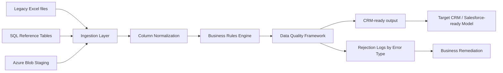

# Enterprise Data Migration Pipeline


Enterprise-style ETL pipeline built with Python and PySpark for enterprise data migration workflows.

The project includes:
- a local execution mode for demonstration purposes;
- a Databricks deployment template supporting Azure Blob Storage and optional Delta Lake exports.

It prepares anonymized legacy ERP/CRM data for a Salesforce-ready target model.
This repository is a portfolio project inspired by real enterprise migration constraints: heterogeneous Excel inputs, SQL reference tables, business-rule mapping, anomaly files, mandatory field checks, duplicate detection, address formatting and final export into a clean target dataset.

> All business names, source systems, field names, values and mappings are anonymized.

---

## Features

- Configurable business rules engine
- Data quality validation framework
- Salesforce-ready target mapping
- Distributed ingestion from Excel, CSV and SQL/JDBC sources
- Column normalization and schema alignment
- Address splitting and target field formatting
- Reference integrity checks
- Duplicate external ID detection with diagnostic columns
- Mandatory field validation with missing-field details
- Rejection logs by anomaly type
- Local CSV export and optional Delta Lake export for Databricks deployments
- GitHub Actions CI for automated tests

---

## Architecture



See [`architecture/migration_flow.md`](architecture/migration_flow.md) for the full flow.

---

## Repository structure

```text
enterprise-data-migration/
├── .github/workflows/
│   └── tests.yml
├── architecture/
├── docs/
├── notebooks/
├── sample_data/
├── src/
│   ├── ingestion/
│   ├── transformations/
│   ├── business_rules/
│   ├── validation/
│   ├── exports/
│   └── utils/
└── tests/
```

---

## Technologies

- Python
- PySpark
- Databricks (deployment template)
- Delta Lake (optional export)
- Azure Blob Storage (deployment template)
- SQL Server JDBC
- Pandas
- Pytest
- GitHub Actions

---

## Example data quality logs

| Log name | Purpose |
|---|---|
| `ERR_MISSING_REGION_MAPPING` | Region code not found in reference mapping |
| `ERR_MISSING_CUSTOMER_REFERENCE` | Customer ID not present in registry |
| `ERR_DUPLICATE_EXTERNAL_ID` | Duplicate target external IDs |
| `ERR_MANDATORY_FIELDS` | Missing mandatory target fields |
| `ERR_INVALID_STATUS` | Source status cannot be mapped to target status |

---

## Example business rule

```python
from src.business_rules.status_mapping import map_status
from src.business_rules.target_mapping import apply_target_mapping

processed = (
    source_df
    .transform(map_status)
    .transform(apply_target_mapping)
)
```

The target external ID is generated with a deterministic upsert key:

```text
CRM_<Region_Code>_<External_ID>
```

---

## Quick start

Install dependencies:

```bash
pip install -r requirements.txt
```

Run tests:

```bash
pytest tests/ -q
```

Run the local sample pipeline:

```bash
python -m src.main --local
```

The local run writes CRM-ready records and data-quality logs into the `outputs/` folder.
The local demo writes CSV outputs for easy inspection.

For Databricks deployments, the export layer also provides an optional `write_delta_table()` function to persist datasets as partitioned Delta Lake tables.

Use [`notebooks/databricks_demo.ipynb`](notebooks/databricks_demo.ipynb) as a deployment template and adapt storage paths, secrets and JDBC settings.

---

## Documentation

- [`docs/business_rules.md`](docs/business_rules.md)
- [`docs/data_quality.md`](docs/data_quality.md)
- [`architecture/migration_flow.md`](architecture/migration_flow.md)

---

## Portfolio note

This project demonstrates a production-style data migration workflow: ingestion, mapping, data quality, anomaly generation and target export. It is not connected to any real customer environment and uses anonymized sample data only.
