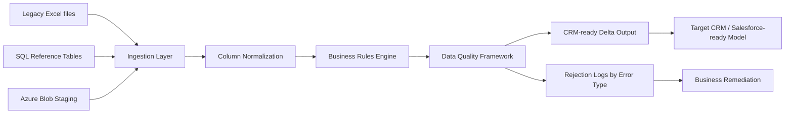

# Migration Flow



## Processing stages

1. **Ingestion**: load Excel, CSV or SQL/JDBC datasets.
2. **Standardization**: normalize column names and clean identifiers.
3. **Business rules**: map statuses, build target IDs and format addresses.
4. **Data quality**: isolate missing mappings, invalid statuses, missing references and duplicate keys.
5. **Export**: write CRM-ready records and anomaly logs.
```
